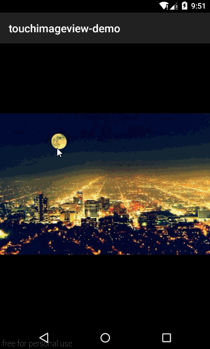

TouchImageView Demo
====================
###1.Demo Download
[本地下载](apk/touchimageview-demo.apk?raw=true"点击下载到本地")  
  
###2.Screenshot  
  
  
###3.Demo Description
Demo包含以下内容：  
* 单个TouchImageView控件的使用(切换图片、切换ScaleType)
* 结合ViewPager使用  
* UIL,Picasoo以及Glide加载图片到TouchImageView的简单测试  

  

